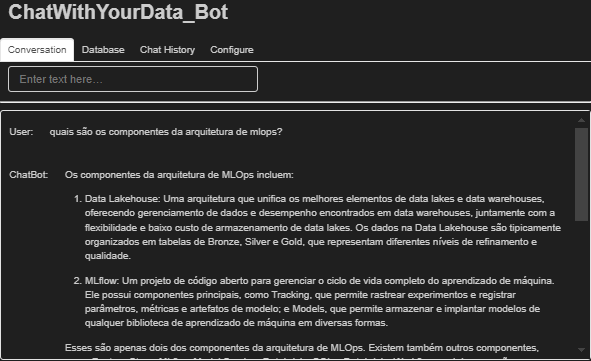

# RAG (Retrieval Augmented Generation) - Chat with your data

This project's goal is to implement the stages of RAG (Retrieval Augmented Generation) for the video [Mais que uma simples intuição](https://www.youtube.com/watch?v=PmhxOtaTPUI), based on [LangChain Chat With Your Data](https://www.deeplearning.ai/short-courses/langchain-chat-with-your-data/) course.

At the end of the notebook, we also developed a frontend to chat with an pdf file: The Big Book Of MLOps.

## Tools

- Python
- Langchain Framework
- Whisper - Speech to Text
- OpenAI APIs - AzureChatOpenAI and AzureOpenAIEmbeddings (Provided by Petrobras)
- Panel (library): Frontend
